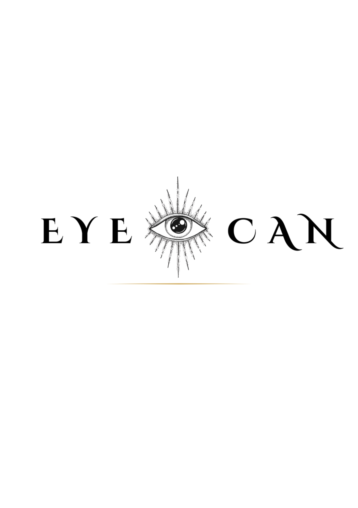
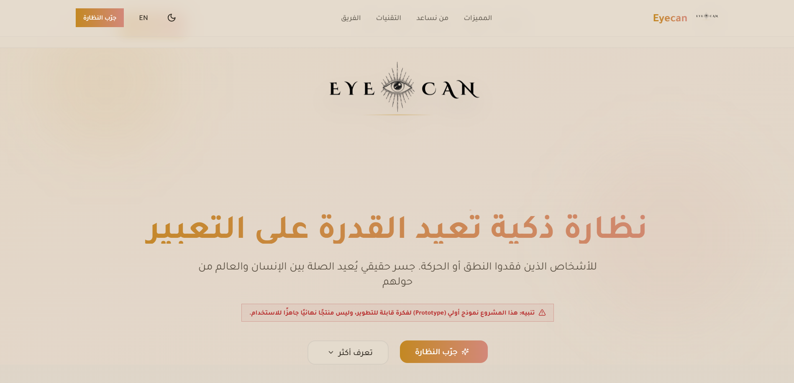
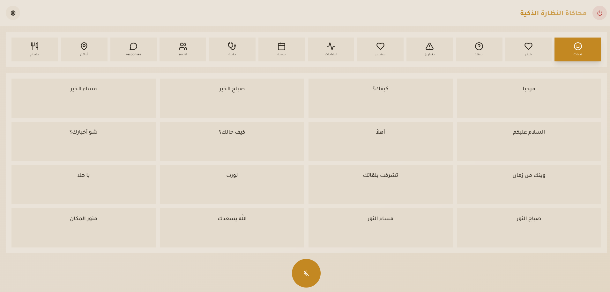

# 👓 Eyecan

<p align="center">
  
</p>

<h1 align="center">
Eyecan
</h1>

<p align="center">
A browser-based assistive technology prototype exploring alternative ways of communication
through gaze interaction, speech recognition, suggested responses, and voice output.
</p>

<p align="center">

👁️ Gaze Interaction • 🎙️ Speech Recognition • 💬 Suggested Responses • 🔊 Voice Output • 🌐 Arabic & English

</p>

---

# ⚠️ Prototype Notice

Eyecan is a **prototype**, not a complete or production-ready product.

The current version demonstrates the concept, interface, and interaction flow
through a browser-based interactive experience.

Some interactions are simulated, such as using the mouse to represent eye gaze,
and some features depend on the capabilities of the user's browser and device.

The purpose of this prototype is to demonstrate the feasibility and direction
of the concept and how it could be developed into a complete assistive
technology product in the future.

---

# 📖 Overview

Eyecan is a smart-glasses concept designed to explore alternative communication
methods for people who may have difficulty speaking or moving while remaining
conscious and able to communicate.

The prototype focuses on providing a simple and accessible communication
experience through:

- Eye-gaze interaction simulation
- Browser-based speech recognition
- Suggested responses
- Browser-based text-to-speech
- Arabic and English interface support
- Adjustable interaction settings

The current implementation is a **Front-End prototype** and does not require
a backend server to run.

---

# ✨ Key Features

- 👁️ **Gaze Interaction Simulation**
  - Mouse interaction is used to simulate eye gaze and dwell time.

- 🎙️ **Speech Recognition**
  - Converts spoken input into text using browser capabilities.

- 💬 **Suggested Responses**
  - Provides contextual response options to simplify communication.

- 🔊 **Text-to-Speech**
  - Converts selected text into spoken audio using browser/device voices.

- 🌐 **Arabic & English Support**
  - The interface supports both Arabic and English.

- ⚙️ **Adjustable Interaction**
  - Users can configure interaction settings such as dwell time and voice type.

- 🖥️ **Browser-Based Prototype**
  - The current prototype runs directly in the browser without a backend server.

---

# 📸 Screenshots

The screenshots below provide an overview of the prototype without requiring
the project to be installed or run.

## Home Page

<p align="center">
  
</p>

The home page introduces the Eyecan concept, its purpose, features,
technologies, and future vision.

---

## Smart Glasses Simulation

<p align="center">
  
</p>

The simulation demonstrates the interaction experience, including microphone
input, speech recognition, suggested responses, and browser-based voice output.

---
# 🔄 Prototype Workflow

The current prototype demonstrates the following interaction flow:

1. The user opens the Eyecan prototype.
2. The user enters the Smart Glasses Simulation.
3. The user can interact with interface elements using mouse-based gaze simulation.
4. The user activates the microphone.
5. The browser listens for speech.
6. Speech is converted into text.
7. Suggested responses are displayed.
8. The user can select a suggested response.
9. The selected response can be converted into spoken audio using the browser.
10. The user can adjust interaction settings such as dwell time and voice type.

---

# 🛠️ Technologies Used

## Web & Interaction

- **Eye Tracking / Gaze Interaction**
  - Mouse-based simulation of gaze and dwell time.

- **Browser Speech Recognition**
  - Speech-to-text using browser capabilities.

- **Browser-Based Interaction**
  - Direct interaction and response inside the browser.

---

## 🔊 Voice & Audio

- **Web Speech API**
- **Speech Recognition**
- **Speech Synthesis**

These capabilities are provided by the browser and device.

Voice availability may differ depending on the browser, operating system,
and installed voices.

---

## 💻 Development

- HTML
- CSS
- JavaScript
- React
- TypeScript / TSX
- Web APIs

---

# 🔮 Future Vision

The following technologies represent a possible architecture for developing
Eyecan into a complete real-world product.

These technologies are **future development possibilities** and are not claimed
to be implemented in the current prototype.

## Frontend

### React / React Native + TypeScript

A future production frontend could provide:

- Smart-glasses interaction
- Companion mobile application
- Accessibility settings
- User preferences
- Voice interaction
- Gaze interaction

---

## Backend

### Python + FastAPI

A future backend could handle:

- User accounts
- Authentication
- Data processing
- APIs
- User preferences
- Database communication
- Integration with intelligent services

---

## AI & Computer Vision

Future versions could integrate AI and Computer Vision for:

- Real eye tracking
- Environment analysis
- Object detection
- Context understanding
- Intelligent response generation

---

## Cloud & Database

A future production system could use secure cloud infrastructure for:

- User accounts
- Saved phrases
- Preferences
- Data synchronization
- Application data

---

# 🧪 Prototype Limitations

The current version does **not** claim to provide:

- Physical smart glasses
- Real eye-tracking hardware
- Production backend
- Production AI system
- Medical-grade functionality
- Clinical validation
- Guaranteed speech recognition across all browsers
- Guaranteed Arabic speech output on every device
- Production cloud infrastructure
- Production-level security

The prototype is intended to demonstrate the concept, interface,
interaction model, and possible future direction.

--------
# 🚀 How to Run the Project

## Prerequisites

Before running Eyecan, make sure you have:

- Git
- Node.js + npm
- Visual Studio Code
- A modern web browser
- A working microphone if you want to test speech recognition

Recommended browsers:

- Google Chrome
- Microsoft Edge
- Another browser with Web Speech API support

> Python is not required to run the current Eyecan prototype.
> Python + FastAPI are part of the future backend vision.

---

## 1. Clone the Repository

Open **Command Prompt (CMD)** or a terminal.

To open CMD on Windows:

1. Press `Windows + R`.
2. Type `cmd`.
3. Press **Enter**.

You can also search for **Command Prompt** from the Windows Start Menu.

---

## 2. Choose Where to Save the Project

For example, to save the project on your Desktop, type:

`cd Desktop`

Then press **Enter**.

You can choose any folder you prefer.

---

## 3. Clone the GitHub Repository

Run:

`git clone https://github.com/ramaalnajjarr2/Eyecan.git`

Press **Enter** and wait until Git finishes downloading the project.

A new folder named `Eyecan` will be created in the selected location.

---

## 4. Open the Project Folder

In CMD, type:

`cd Eyecan`

Press **Enter**.

Then enter the Front-End folder:

`cd frontend`

Press **Enter**.

You should now be inside the folder containing `package.json`.

---

## 5. Open the Project in Visual Studio Code

If the VS Code command is available, type:

`code .`

Then press **Enter**.

The project should open automatically in Visual Studio Code.

### If `code .` Does Not Work

Open **Visual Studio Code** manually.

Then:

1. Click **File**.
2. Select **Open Folder**.
3. Find the `Eyecan` folder.
4. Open the `frontend` folder.
5. Select the `frontend` folder.
6. Click **Select Folder**.

---

## 6. Open the Terminal in VS Code

Inside Visual Studio Code, go to:

**Terminal → New Terminal**

A terminal will appear at the bottom of VS Code.

Make sure the terminal is inside:

`Eyecan\frontend`

The path should look similar to:

`...\Eyecan\frontend>`

---

## 7. Install Project Dependencies

In the VS Code terminal, run:

`npm install`

Then press **Enter**.

Wait until the installation finishes.

This installs the packages required by the project.

> `npm install` normally needs to be run only when setting up the project for
> the first time or when the project's dependencies change.

---

## 8. Start the Development Server

After `npm install` finishes, run:

`npm run dev`

Then press **Enter**.

Vite will start the development server.

You should see an address similar to:

`Local: http://localhost:5173/`

The exact port may be different on your computer.

---

## 9. Open Eyecan in Your Browser

Copy the **Local** address shown in the terminal.

For example:

`http://localhost:5173/`

Paste it into your modern web browser and press **Enter**.

🎉 Eyecan should now be running.

> Always use the exact Local address displayed by Vite if the port is different.

---

## 10. Test the Microphone

To test speech recognition:

1. Open the **Smart Glasses Simulation**.
2. Activate the microphone.
3. The browser will ask for microphone permission.
4. Select **Allow**.
5. Speak clearly.
6. The browser will attempt to recognize your speech.
7. The recognized text will appear in the interface.
8. Suggested responses may appear.

A working microphone and browser support are required for this feature.

---

## 11. Test Voice Output

Eyecan uses the speech capabilities provided by the **browser and device**.

The available voices may differ depending on:

- Browser
- Operating system
- Installed voices
- Device language settings

The current prototype does **not** use a separate Google Text-to-Speech backend.

---

## 🇸🇦 If Arabic Voice Does Not Work

If Arabic text does not produce sound:

### 1. Check the volume

Make sure your computer is not muted.

### 2. Try English

Try an English phrase.

If English produces sound but Arabic does not, the browser or device may not
have a compatible Arabic speech voice available.

### 3. Try another browser

Try:

- Google Chrome
- Microsoft Edge

### 4. Check Arabic voice availability

Make sure an Arabic speech voice is available on your operating system and
browser/device.

### 5. Refresh the page

After changing the language or voice settings, refresh the Eyecan page.

> Arabic speech availability depends on the browser and device. If English
> works while Arabic does not, this does not necessarily mean that the Eyecan
> code is broken.

---

## 🎙️ If Speech Recognition Does Not Work

If the microphone does not recognize your speech:

1. Make sure your microphone is connected.
2. Make sure the browser has microphone permission.
3. Check that the correct microphone is selected.
4. Try Google Chrome or Microsoft Edge.
5. Refresh the page.
6. Speak clearly and close to the microphone.

Speech recognition support can vary between browsers and devices.

---

## 👁️ Eye Tracking Simulation

The current prototype does **not** use physical eye-tracking hardware.

The mouse is used to simulate eye gaze and dwell time.

Mouse hover and configurable dwell time demonstrate how looking at an interface
element could eventually trigger an action.

In a future hardware implementation, the mouse simulation could be replaced with
real eye-tracking technology.

---

# 📁 Project Structure

```text
Eyecan
│
├── Assets
│   ├── logo.png
│   ├── screenshots
│   │   ├── home.png
│   │   └── simulation.png
│   ├── documentation
│   │   ├── Eyecan-Report-AR.pdf
│   │   └── Eyecan-Report-EN.pdf
│   └── presentation
│       └── Eyecan-Presentation.pptx
│
├── frontend
│   ├── src
│   ├── public
│   ├── package.json
│   ├── package-lock.json
│   ├── vite.config.ts
│   ├── tailwind.config.ts
│   └── tsconfig.json
│
├── .gitignore
└── README.md

------------
# 📚 Documentation

## 🇯🇴 Arabic Documentation

📄 [Open Arabic Report](assets/documentation/Eyecan-Report-AR.pdf)

---

## 🇬🇧 English Documentation

📄 [Open English Report](assets/documentation/Eyecan-Report-EN.pdf)

---

# 📎 Presentation

🎤 [Open Eyecan Presentation](assets/presentation/Eyecan-Presentation.pptx)